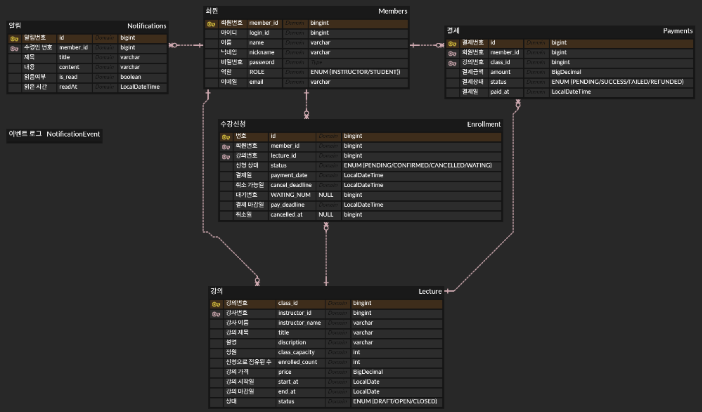

# class-booking

## 프로젝트 개요

강사가 강의를 개설하고, 수강생이 수강 신청과 결제를 진행할 수 있는 온라인 강의 관리 시스템입니다.

주요 기능은 다음과 같습니다.

- 강의 생성, 목록 조회, 상세 조회
- 강의 오픈/마감
- 수강 신청 등록 (정원 마감 시, 자동 대기 등록)
- 수강 신청 즉시 정원 점유
- 결제 완료 이벤트 기반 수강 확정
- 수강 취소 이벤트 기반 결제 환불
- 내 수강 신청 목록 조회
- 강사 전용 강의별 수강생 목록 조회

## 기술 스택

- Java 21
- Spring Boot 4.0.6
- Spring Web MVC
- Spring Data JPA
- Spring Transaction
- Spring Retry
- H2 Database
- PostgreSQL
- Gradle Kotlin DSL
- Docker / Docker Compose
- JUnit 5, AssertJ, Mockito

## 실행 방법

로컬 실행은 H2 인메모리 DB를 사용합니다.

```bash
./gradlew bootRun
```

Windows 환경:

```bash
gradlew.bat bootRun
```

Docker Compose 실행:

```bash
docker compose up --build
```

Docker Compose 실행 시 PostgreSQL과 애플리케이션이 함께 실행됩니다.

- App: `http://localhost:8080`
- PostgreSQL: `localhost:5432`
- DB: `app_db`
- User: `app_user`
- Password: `app_pass`

## 요구사항 해석 및 가정

- `X-Member-Id` 요청 헤더를 인증된 사용자 ID로 간주합니다.
- 회원가입/로그인/인증 인프라는 범위 밖으로 두었습니다.
- 강의 생성, 오픈, 마감은 강사 본인만 수행할 수 있습니다.
- 수강 신청은 강의가 `OPEN` 상태일 때만 가능합니다.
- 수강 신청 시점에 정원을 점유합니다. 결제 시점이 아닙니다.
- 정원이 가득 찬 경우 수강 신청을 실패시키지 않고 `WAITLISTED` 상태로 저장합니다.
- 결제는 `PENDING` 상태의 수강 신청에 대해서만 가능합니다.
- 결제 마감일이 지난 수강 신청은 결제 저장 전에 차단합니다.
- 결제 완료 시 수강 신청 상태가 `CONFIRMED`로 변경됩니다.
- 수강 취소는 `CONFIRMED` 상태에서만 가능하며, 취소 가능 마감일 전까지만 가능합니다.
- 수강 취소 후 결제 환불은 이벤트로 분리해 처리합니다.

## 설계 결정과 이유

수강 신청 시 비관적 락을 사용했습니다.

- 같은 강의에 대한 동시 수강 신청을 직렬화해 정원 초과를 방지합니다.
- 정원 내 신청은 `PENDING`, 정원 초과 신청은 `WAITLISTED`로 저장합니다.

결제 완료와 수강 확정은 이벤트로 분리했습니다.

- 결제 저장 후 `PaymentConfirmedEvent`를 발행합니다.
- 수강관리 쪽 리스너가 이벤트를 받아 `Enrollment.confirmPayment()`를 수행합니다.
- 이벤트는 `AFTER_COMMIT`에 처리되어 결제 트랜잭션 커밋 이후 실행됩니다.
- 수강 확정은 `REQUIRES_NEW` 트랜잭션으로 처리됩니다.
- 일시 실패를 대비해 Spring Retry를 적용했습니다.

수강 취소와 결제 환불도 이벤트로 분리했습니다.

- `Enrollment.withdraw(...)` 후 `EnrollmentWithdrawnEvent`를 발행합니다.
- 결제 쪽 리스너가 이벤트를 받아 `Payment.refund()`를 수행합니다.
- 환불도 별도 트랜잭션과 재시도 대상으로 처리합니다.

결제 가능 여부는 결제 저장 전에 검증합니다.

- `Enrollment.validatePayable(memberId)`에서 소유자, 상태, 결제 마감일을 검증합니다.
- 비즈니스 실패는 결제 저장 전에 차단합니다.
- 서버 오류 등 일시 실패는 이벤트 처리 재시도로 대응합니다.

## 미구현 / 제약사항

- 실제 인증/인가, 토큰 검증은 구현하지 않았습니다.
- 회원 생성 API는 없습니다.
- 전역 예외 응답 포맷은 미구현 상태입니다.
- 결제는 외부 PG 연동 없이 성공 결제로 가정합니다.
- 이벤트는 애플리케이션 내부 Spring 이벤트입니다.
- 서버가 재시도 중 종료되면 이벤트가 유실될 수 있습니다.
- 운영 수준의 안정성을 위해서는 Outbox 패턴, 메시지 브로커, 실패 이벤트 저장소, 재처리 스케줄러가 필요합니다.
- 대기열 승격 정책은 구현하지 않았습니다.

## AI 활용 범위

AI는 다음 작업에 활용했습니다.

- 설계 대안 검토
- 비관적 락 적용 위치 검토
- 작성한 코드의 리뷰 및 개선 제안
- 테스트 코드 작성 보조
- README 문서 작성 보조

최종 구현 방향과 도메인 정책은 요구사항에 맞춰 직접 결정했습니다.

## API 목록 및 예시

공통으로 사용자 식별이 필요한 API는 `X-Member-Id` 헤더를 사용합니다.

### Health Check

```http
GET /
```

### 강의 생성

```http
POST /lecture
X-Member-Id: 1
Content-Type: application/json

{
  "title": "Spring Boot",
  "description": "Spring Boot basics",
  "capacity": 30,
  "price": 50000,
  "startAt": "2026-05-01T10:00:00",
  "endAt": "2026-06-01T10:00:00"
}
```

### 강의 목록 조회

```http
GET /lecture/list?status=OPEN&page=0&size=10
```

`status`는 선택값입니다.

### 강의 상세 조회

```http
GET /lecture/1
X-Member-Id: 1
```

### 강의 오픈

```http
PATCH /lecture/1/open
X-Member-Id: 1
```

### 강의 마감

```http
PATCH /lecture/1/close
X-Member-Id: 1
```

### 수강 신청

```http
POST /enrollment/1/enroll
X-Member-Id: 2
```

정원 내 신청이면 `PENDING`, 정원 초과면 `WAITLISTED`로 저장됩니다.

### 수강 취소

```http
POST /enrollment/10/withdraw
X-Member-Id: 2
```

### 내 수강 신청 목록

```http
GET /enrollment/list?status=PENDING&page=0&size=10
X-Member-Id: 2
```

`status`는 선택값입니다.

### 강의별 수강생 목록

```http
GET /enrollment/lectures/1/students?status=CONFIRMED&page=0&size=10
X-Member-Id: 1
```

강사 본인의 강의만 조회할 수 있습니다.

응답 예시:

```json
{
  "content": [
    {
      "memberId": 2,
      "name": "홍길동",
      "status": "CONFIRMED"
    }
  ]
}
```

### 결제 확정

```http
PATCH /payment/confirm
X-Member-Id: 2
Content-Type: application/json

{
  "enrollmentId": 10,
  "amount": 50000
}
```

## 데이터 모델 설명

### Member

회원 정보입니다.

- `memberId`: 로그인 ID 성격의 문자열
- `name`: 이름
- `nickname`: 닉네임
- `email`: 이메일
- `password`: 비밀번호
- `role`: `INSTRUCTOR`, `STUDENT`

### Lecture

강의 정보입니다.

- `instructorId`: 강사 회원 ID
- `instructorName`: 강사 이름
- `title`: 강의명
- `description`: 강의 설명
- `capacity`: 정원
- `enrolledCount`: 신청으로 점유된 좌석 수
- `price`: 가격
- `startAt`, `endAt`: 강의 기간
- `status`: `DRAFT`, `OPEN`, `CLOSED`

### Enrollment

수강 신청 정보입니다.

- `memberId`: 수강생 회원 ID
- `lectureId`: 강의 ID
- `status`: `PENDING`, `CONFIRMED`, `CANCELLED`, `WAITLISTED`
- `paymentDate`: 결제 및 수강 확정 일시
- `cancelDeadline`: 수강 취소 가능 마감일
- `payDeadline`: 결제 마감일
- `cancelledAt`: 수강 취소 일시

`memberId + lectureId`는 중복 신청 방지를 위해 unique 제약을 가집니다.

### Payment

결제 정보입니다.

- `memberId`: 결제자 회원 ID
- `enrollmentId`: 결제 대상 수강 신청 ID
- `amount`: 결제 금액
- `status`: `PENDING`, `SUCCESS`, `FAILED`, `REFUNDED`
- `paymentAt`: 결제 일시
- `refundedAt`: 환불 일시

## 테스트 실행 방법

전체 테스트 실행:

```bash
./gradlew test
```

Windows 환경:

```bash
gradlew.bat test
```

주요 테스트 범위:

- 강의 생성/조회/오픈/마감
- 수강 신청 정원 처리 및 대기 등록
- 결제 성공 후 이벤트 기반 수강 확정
- 수강 확정 실패 시 결제 트랜잭션 보존
- 결제 마감일 초과 시 결제 저장 전 차단
- 수강 취소 후 이벤트 기반 결제 환불
